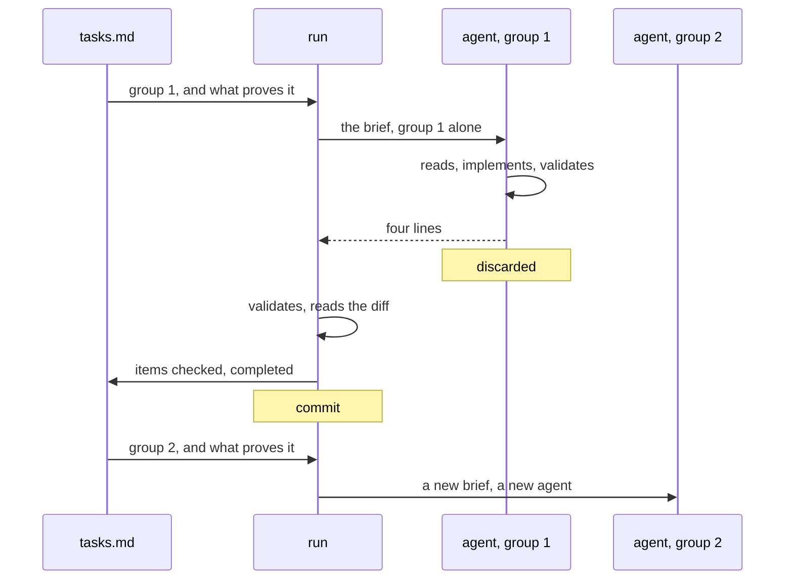

changepack was built on a claim: running a change through it costs less than
implementing the same thing by hand. A procedure cannot make that good by
being wise. It has to be cheap to load, and it has to stay cheap while a
change runs for hours across many turns.

So context is treated here the way latency is treated in a database. It is a
requirement with a number on it, and something fails when the number is
missed. Everything on this page follows from that, and none of it binds a
change: the rules live in the documents `normative:` names.

## The budget is a requirement, not a virtue

A long session pays for its whole history on every turn. That is the cost
changepack exists to cut, which means the procedure is the first thing that
has to answer for its own size. A tool that ships thirty thousand characters
of instruction and loads all of it has already spent what it promised to
save.

The budget is therefore written down like any other requirement. Not as an
intention to keep things tidy, and not as a taste for short files, but as
ceilings that a machine reads.

## Ceilings a machine can check

`npm run check` measures three things and fails when any of them is over.
`SKILL.md`, which is always loaded once the skill engages, has a ceiling of
3.6k characters. So does the widest single route, because a route is loaded
whole or not at all. All of the procedure's markdown together has a ceiling
of about 34k, which is a drift alarm rather than a cost: nothing loads it
all.

A size limit that only a reviewer enforces is a preference. This one runs on
every task group, next to the tests, so a route that grows past what a turn
can afford stops the work that grew it. That is the difference between a
budget and a wish, and it is
[one of the invariants](/changepack/en/internals/invariants/) this repository
holds about itself.

The numbers are calibration, not law. They came from measuring what a turn
actually loads, against cold and warm starts and against different ways of
cutting a change into groups, and they are expected to move as the procedure
grows. What matters is that what enters context is measured, not that it
stays under a number chosen once.

## One route at a time

Nothing is loaded before it is needed, and nothing needed is loaded twice.

The skill's description stays resident on every turn, which is what lets
changepack recognise the moment without being invoked. It is under four
hundred characters, so being resident costs nothing worth counting.
[SKILL.md](/changepack/en/refs/) loads when the answer is yes, and it is a
routing table rather than a manual: it says which route the work takes and
declines to explain the route.

Then one route loads. Planning loads `plan.md` and never sees how closure
audits. A group being implemented loads `work.md` and never sees the form of
a package it is not writing. A turn loads between four and eight thousand
characters depending on where it goes, and the other twenty five thousand sit
on disk unread.

That is also what keeps the routes small. Each one has to fit the ceiling
alone, so a route cannot absorb a neighbour's material to save itself a
reference. The structure is enforced by the budget rather than by discipline.

## Small is a performance decision

None of this is minimalism for its own sake. The measure that matters is
quality per token: how much correct, finished work comes back for what the
turn spent. Cutting tokens by cutting instruction fails that measure as
surely as loading everything does.

Short prose scores better on it for a second reason, which is that a route
short enough to be read completely is followed completely. A procedure that
sprawls is skimmed, and a skimmed rule is not a rule. Structure that stays
small is bought for cost and paid back in accuracy.

## A run does not carry its history

The budget also has to survive the change, and a change is many turns. This
is where the shape of the run does the work.

A change is cut into groups, each with one verifiable outcome. When a change
has more than one group left, the conversation driving it dispatches rather
than implements, and three parties share the work. On one side
[tasks.md](/changepack/en/refs/tasks/) holds the groups, their order and the
validation that proves each one. In the middle the `run` route holds the
package and nothing else. On the other side one agent per group, fresh every
time, each seeing its own group and never the conversation.

The brief is the interface. The agent gets `CHANGEPACK.md`, `change.md`,
`tasks.md` and the one group it owns, inline and in full. It does not get the
session that produced them. What comes back is four lines and nothing else:
the files touched, the validation and its result, at most two sentences for
the next group, and whether anything is blocked. If more comes back, the four
lines are kept and the rest is discarded.

So the coordinator holds the minimum state that the next decision needs, and
a change with eight groups does not cost eight times a change with one. What
a group spends implementing is still what it spends. Nothing else
accumulates.

Context is not the only reason for a fresh agent. A reused one stops looking:
it describes what it remembers instead of what is there, which is how a diff
gets reported that nobody wrote. The cheap choice and the accurate one happen
to be the same choice.

## Commits are the checkpoints

Discarding an agent is only safe because nothing important lived in it. Each
group is committed on its own the moment it passes, so the state that
survives is the repository and the folder, never a conversation. A run that
stops in the middle resumes by reading `tasks.md`, from a session that knows
nothing about the one before it.

Sequential is the default and it is the simple thing. `order:` declares which
groups could run in parallel, and a single working tree cannot deliver that
safely, so the declaration is honest about intent rather than a promise of
concurrency. Worktrees would make the collision impossible and remain an open
direction, weighed against the working tree being what makes the work
watchable.

## Nothing runs past the change

There is no queue. One change is approved, run to its end, and closed, and
nothing starts the next one without a person. Dispatching group by group is
the most autonomy this design carries, and it is safe precisely because it is
bounded by a unit somebody approved.

An agent left to chain changes on its own would produce the thing the budget
was protecting against in the first place: work that nobody followed, at a
cost nobody watched. The focus is following the work, not automating past it.
