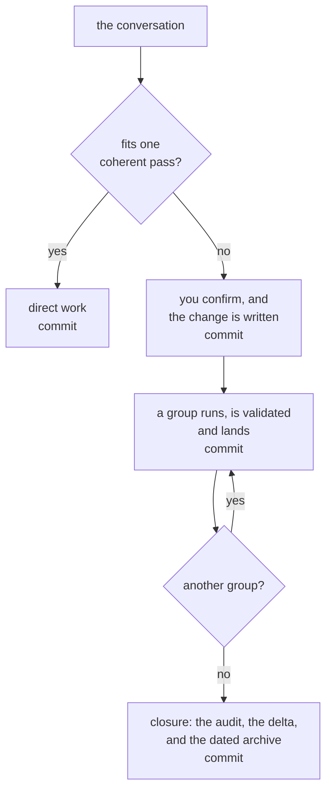
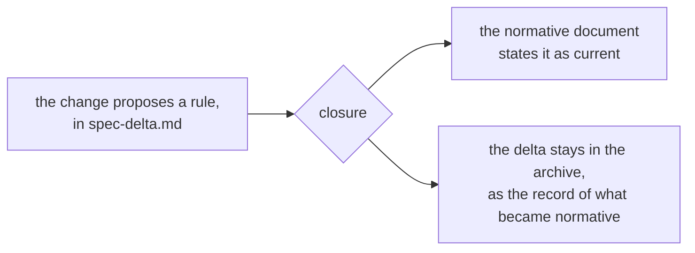

A change is three files in a folder, and the folder is the point. It holds the
problem, the work and the proof in one place, from the conversation that
started it to the archive it ends in.

This page is about why it holds those parts. What goes in each field is
[the reference](/changepack/en/refs/change/), which is a different question
and a different page.

## The whole flow

It starts in a conversation you were having anyway. The gate classifies what
you asked for, and work that fits in one coherent pass never becomes a change.

Where it does not fit, you are asked before anything is written. Then the
change is written and committed, and the run stops there: planning never
implements in the same turn, so you read the folder before a line of the work
exists.

After that it runs group by group. Each group is dispatched on its own, it is
validated, and it commits, so the next one starts on a clean tree. Closure
audits the behavior that exists, folds any delta into the document it belongs
in, and moves the folder to `changes/archive/<date>-<slug>/`.

A change commits at three of those steps, and each one commits alone.
[Git](/changepack/en/start/git/) is where that is laid out.

## Context, and the goal

Two sections, and the whole change hangs from the pair.

**Context** says what is true today and why that is a problem. It is written
about the repository as it stands, in the present tense, not about what
somebody should have done earlier.

**Goal** says what has to be true at closure. It is behavior rather than work:
something you could observe if you were handed the repository afterwards and
told nothing about how it got that way. A goal that describes what the agent
will do instead of what will be true is a task list wearing the wrong hat.

Those two are what make the change readable a year later by someone who was
not there. Everything else in the folder is downstream of them.

## The drawing

Written last and read first.

The agent draws it once it understands the change, and it is the first thing
you look at. You validate the reasoning by looking rather than by reading
paragraphs, which is why the drawing shows what moves and nothing else, and
why the prose under it never repeats it.

The notation follows what changed: a tree for files, a table for a schema, a
sequence for an order in time, a flow for a routing. Tree and table come
first, because they read in a terminal and on a forge with nothing installed.
[The four, drawn](/changepack/en/refs/change/#the-drawing).

If nothing structural moves there is no drawing. And there probably did not
need to be a change.

## The decisions

This is the part with no equivalent in a ticket.

A change lists every open question about domain, schema, persistence,
compatibility, authorization or observable behavior, with the alternatives and
what each one costs in a table, and the recommendation in prose under it. A
change with an unanswered decision is not approvable: either the answer is
obtained now and recorded, or the decision is written down as blocking, and
the group waiting on it says so.

Answered decisions move to `Decided`, and are never deleted. That is the
difference between a change and a task. The task says what to do; the change
says what was chosen and what the other option would have cost. Six months
later that is the only part anybody needs.

Past two blocking decisions the shape of the work is not settled. The change
says so, with the count, and offers to settle them first. It is not refused.

## The groups, and what proves them

The work is cut into groups, each with a single verifiable outcome and a
validation line that proves it. They are ordered by dependency, `order:` says
which ones can run in parallel, and `blocked:` names the ones waiting on a
decision.

An item is checked only after its own validation passes. Not at the commit,
and not at the end of the group. A checkbox is a fact about behavior, never a
report of effort.

That is one half of the proof. The other half is the success criteria, and
they are checked differently: closure audits each criterion against behavior
that exists, not against tasks that are ticked. A folder full of ticked boxes
proves nothing by itself, which is exactly why the audit reads the two apart.

| | What it claims | What checks it |
|---|---|---|
| An item | one concrete edit landed | its own validation, at the moment it lands |
| A group | one verifiable outcome exists | the validation line under the group |
| A success criterion | the goal is true | closure, against behavior rather than checkboxes |

## The delta, only where it is earned

A change carries a [spec-delta.md](/changepack/en/refs/spec-delta/) only when
it alters something a later change will be held to. That is the whole
condition, and it is not whether the project has specifications.

Renaming a heading does not qualify. Changing what a rule obliges does.

Nothing is written into a normative document while the change is open. The
proposed rule lives in the delta, and the document keeps stating what is true
today until the behavior exists. At closure the delta is folded in one heading
at a time, and where a rule landed differently from how it was declared, its
line says so.

A repository that starts with nothing normative accumulates it one change at a
time, and only where a change paid for it.

## The archive is history, not a backlog

A change that closes is archived under the date it closed, and the archive is
only ever added to.

That is what makes writing it worthwhile. A ticket is a message to whoever is
about to do the work, and it dies when the work is done. A change is a message
to whoever reads the repository afterwards, and it is written to be read after
it closes. The reasoning that did not fit in a commit message is in there,
which is why the commit messages can stay short.

A change that will not ship is archived too, never deleted, with what was
built and left behind and what would have to be true for the work to come
back. [Abandoning, reverting and purging](/changepack/en/start/git/) are three
different operations, and only the first has a route.

Nothing prunes the archive today. Whether something should, and what it would
have to keep, is an open question rather than a plan.

## Dependencies between changes

Two things get confused here, and only one of them is refused.

**Chaining execution is refused.** A queue running the agent unattended across
several approved changes is more autonomy than this design should carry.
Running one change to the end is bounded by one approved unit, and that
boundary is the reason it is safe to leave running.

**Recording that one change depends on another is not refused.** It is simply
not there yet, and it is a fact worth keeping. If it arrives, it arrives as a
line in a document rather than as a scheduler.

The distinction is the whole point. A change knowing about another change is a
note. A change waiting for another change is machinery, and machinery is what
this is not.
