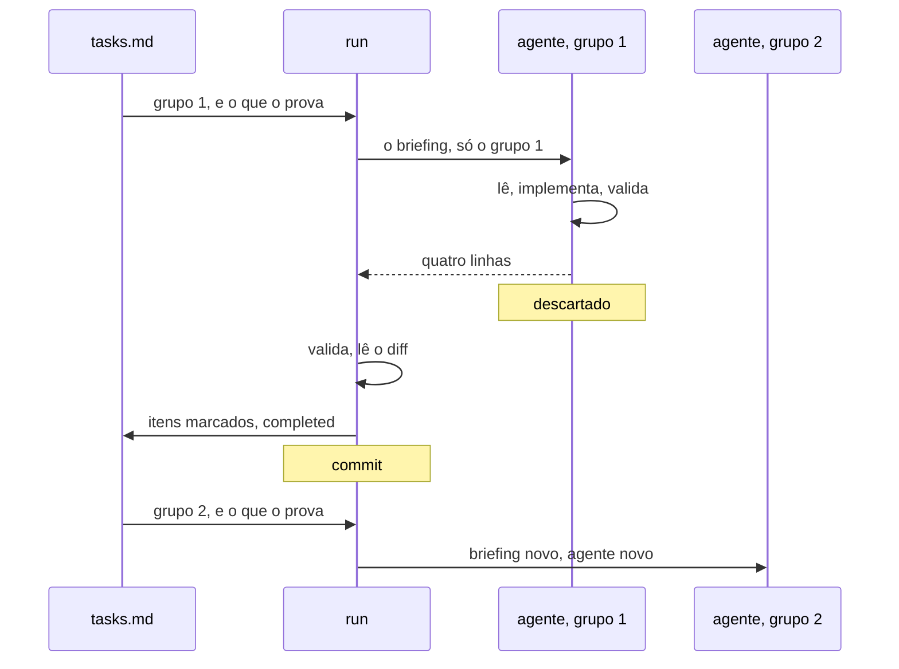

O changepack foi construído sobre uma promessa: rodar uma change por ele custa
menos do que implementar a mesma coisa na mão. Um procedimento não cumpre isso
sendo sábio. Ele precisa ser barato de carregar, e precisa continuar barato
enquanto uma change roda por horas, ao longo de muitos turnos.

Então contexto aqui é tratado como latência é tratada num banco de dados. É um
requisito com um número, e alguma coisa quebra quando o número não é cumprido.
Tudo nesta página decorre disso, e nada aqui prende uma change: as regras moram
nos documentos que o `normative:` nomeia.

## O orçamento é requisito, não virtude

Uma sessão longa paga pelo histórico inteiro a cada turno. É esse o custo que o
changepack existe para cortar, o que faz do próprio procedimento a primeira
coisa que tem que responder pelo próprio tamanho. Uma ferramenta que entrega
trinta mil caracteres de instrução e carrega todos eles já gastou o que
prometia economizar.

Por isso o orçamento está escrito como qualquer outro requisito. Não como
intenção de manter as coisas arrumadas, nem como gosto por arquivos curtos, mas
como tetos que uma máquina lê.

## Tetos que uma máquina confere

O `npm run check` mede três coisas e falha quando qualquer uma passa. O
`SKILL.md`, que é sempre carregado assim que a skill entra, tem teto de 3,6 mil
caracteres. A rota mais larga tem o mesmo teto, porque uma rota carrega inteira
ou não carrega. O markdown todo do procedimento tem teto de uns 34 mil, que é
alarme de deriva e não custo: nada carrega tudo.

Um limite de tamanho que só um revisor cobra é uma preferência. Este roda a
cada grupo de tarefas, junto dos testes, então uma rota que cresce além do que
um turno aguenta trava o trabalho que a fez crescer. É essa a diferença entre
um orçamento e um desejo, e é
[uma das invariantes](/changepack/pt/internals/invariants/) que este
repositório mantém sobre si mesmo.

Os números são calibragem, não lei. Eles vieram de medir o que um turno de fato
carrega, contra partidas frias e quentes e contra formas diferentes de cortar
uma change em grupos, e a expectativa é que se mexam conforme o procedimento
cresce. O que importa é que o que entra em contexto seja medido, não que fique
abaixo de um número escolhido uma vez.

## Uma rota por vez

Nada é carregado antes de ser preciso, e nada que é preciso carrega duas vezes.

A `description` da skill fica residente a cada turno, e é ela que deixa o
changepack reconhecer o momento sem ser invocado. Ela tem menos de quatrocentos
caracteres, então ficar residente não custa nada que valha contar. O
[SKILL.md](/changepack/pt/refs/) carrega quando a resposta é sim, e ele é uma
tabela de roteamento em vez de um manual: diz qual rota o trabalho toma e se
recusa a explicar a rota.

Aí uma rota carrega. Planejar carrega o `plan.md` e nunca vê como o fechamento
audita. Um grupo sendo implementado carrega o `work.md` e nunca vê o formato de
um pacote que não está escrevendo. Um turno carrega entre quatro e oito mil
caracteres, dependendo de para onde vai, e os outros vinte e cinco mil ficam em
disco sem ser lidos.

É isso também que mantém as rotas pequenas. Cada uma tem que caber no teto
sozinha, então nenhuma consegue absorver o material da vizinha para se poupar
uma referência. A estrutura é sustentada pelo orçamento, e não por disciplina.

## Ser pequeno é decisão de performance

Nada disso é minimalismo por esporte. A medida que importa é qualidade por
token: quanto trabalho correto e terminado volta pelo que o turno gastou.
Cortar tokens cortando instrução falha nessa medida tanto quanto carregar tudo
falha.

Prosa curta pontua melhor por um segundo motivo, que é o de uma rota curta o
bastante para ser lida inteira ser seguida inteira. Um procedimento espalhado é
lido na diagonal, e regra lida na diagonal não é regra. Estrutura que continua
pequena é comprada por custo e devolvida em acerto.

## Uma execução não carrega o próprio histórico

O orçamento também tem que sobreviver à change, e uma change são muitos turnos.
É aqui que o formato da execução faz o trabalho.

Uma change é cortada em grupos, cada um com um resultado verificável. Quando
sobra mais de um grupo, a conversa que conduz a change despacha em vez de
implementar, e três partes dividem o trabalho. De um lado o
[tasks.md](/changepack/pt/refs/tasks/) guarda os grupos, a ordem deles e a
validação que prova cada um. No meio a rota `run` guarda o pacote e mais nada.
Do outro lado um agente por grupo, novo toda vez, cada um enxergando só o
grupo dele e nunca a conversa.

O briefing é a interface. O agente recebe o `CHANGEPACK.md`, o `change.md`, o
`tasks.md` e o único grupo que é dele, inline e por inteiro. Ele não recebe a
sessão que produziu tudo isso. O que volta são quatro linhas e mais nada: os
arquivos tocados, a validação e o resultado dela, no máximo duas frases para o
próximo grupo, e se alguma coisa está bloqueada. Se vier mais, ficam as quatro
linhas e o resto é descartado.

Assim o coordenador guarda o mínimo de estado que a próxima decisão precisa, e
uma change de oito grupos não custa oito vezes uma change de um grupo. O que um
grupo gasta implementando continua sendo o que ele gasta. Nada além disso se
acumula.

Contexto não é o único motivo do agente novo. Um agente reaproveitado para de
olhar: ele descreve o que lembra em vez do que está lá, que é como se relata um
diff que ninguém escreveu. A escolha barata e a escolha certa por acaso são a
mesma escolha.

## Commits são os checkpoints

Descartar um agente só é seguro porque nada importante morava dentro dele. Cada
grupo é comitado sozinho assim que passa, então o estado que sobrevive é o
repositório e a pasta, nunca uma conversa. Uma execução que para no meio
recomeça lendo o `tasks.md`, de uma sessão que não sabe nada sobre a
anterior.

Sequencial é o padrão e é a coisa simples. O `order:` declara quais grupos
poderiam rodar em paralelo, e uma árvore de trabalho só não entrega isso com
segurança, então a declaração é honesta sobre a intenção em vez de ser promessa
de concorrência. Worktrees tornariam a colisão impossível e seguem como direção
em aberto, pesadas contra a árvore de trabalho ser o que torna o trabalho
observável.

## Nada roda além da change

Não existe fila. Uma change é aprovada, rodada até o fim e fechada, e nada
começa a próxima sem uma pessoa. Despachar grupo a grupo é a maior autonomia
que este desenho carrega, e ela é segura justamente por ser limitada a uma
unidade que alguém aprovou.

Um agente solto encadeando changes por conta própria produziria exatamente o
que o orçamento protegia desde o começo: trabalho que ninguém acompanhou, a um
custo que ninguém olhou. O foco é seguir o trabalho, não automatizar por cima
dele.
