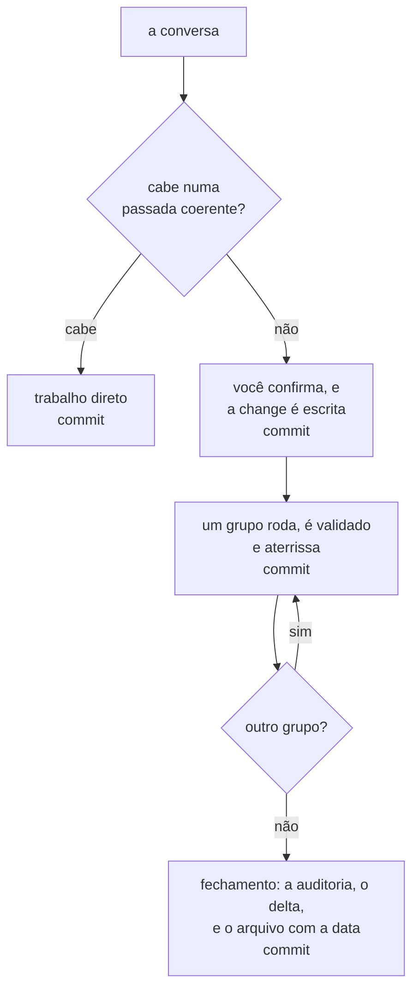
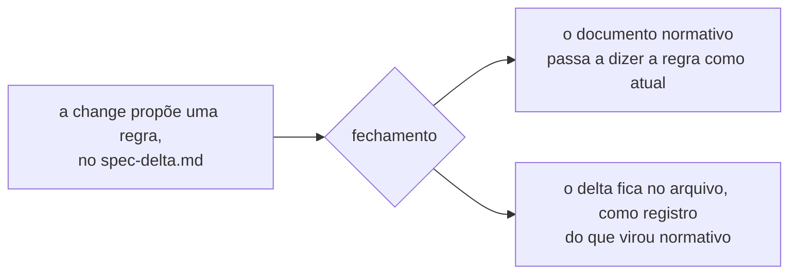

Uma change são três arquivos numa pasta, e a pasta é o ponto. Ela guarda o
problema, o trabalho e a prova num lugar só, da conversa que a começou até o
arquivo em que ela termina.

Esta página é sobre por que ela carrega essas partes. O que vai em cada campo
está na [referência](/changepack/pt/refs/change/), que é outra pergunta e
outra página.

## O fluxo inteiro

Começa numa conversa que você já estava tendo. O gate classifica o que você
pediu, e trabalho que cabe numa passada coerente nunca vira change.

Onde não cabe, você é perguntado antes de qualquer coisa ser escrita. Aí a
change é escrita e comitada, e a rodada para ali: planejar nunca implementa no
mesmo turno, então você lê a pasta antes de uma linha do trabalho existir.

Depois disso ela roda grupo a grupo. Cada grupo é despachado sozinho, é
validado, e comita, então o próximo começa numa árvore limpa. O fechamento
audita o comportamento que existe, dobra o delta no documento a que ele
pertence, e move a pasta para `changes/archive/<data>-<slug>/`.

Uma change comita em três desses passos, e cada um comita sozinho. O
[Git](/changepack/pt/start/git/) é onde isso está detalhado.

## O contexto, e o objetivo

Duas seções, e a change inteira se pendura nesse par.

O **contexto** diz o que é verdade hoje e por que isso é um problema. Ele é
escrito sobre o repositório como ele está, no presente, e não sobre o que
alguém deveria ter feito antes.

O **objetivo** diz o que precisa ser verdade no fechamento. É comportamento e
não trabalho: algo que você conseguiria observar se recebesse o repositório
depois e ninguém te contasse como ele chegou ali. Um objetivo que descreve o
que o agente vai fazer em vez do que vai ser verdade é uma lista de tarefas
com o chapéu errado.

Esses dois são o que deixa a change legível um ano depois para alguém que não
estava lá. Todo o resto da pasta vem depois deles.

## O desenho

Escrito por último e lido primeiro.

O agente desenha quando já entendeu a change, e é a primeira coisa que você
olha. Você valida o raciocínio olhando em vez de ler parágrafo, e é por isso
que o desenho mostra o que se move e mais nada, e que a prosa embaixo dele
nunca o repete.

A notação segue o que mudou: uma árvore para arquivos, uma tabela para um
schema, uma sequência para uma ordem no tempo, um fluxo para um roteamento.
Árvore e tabela vêm primeiro, porque leem num terminal e numa forge sem nada
instalado. [As quatro, desenhadas](/changepack/pt/refs/change/#o-desenho).

Se nada estrutural se move, não há desenho. E provavelmente não precisava de
change.

## As decisões

Esta é a parte que não tem equivalente num ticket.

Uma change lista toda pergunta aberta sobre domínio, schema, persistência,
compatibilidade, autorização ou comportamento observável, com as alternativas
e quanto cada uma custa numa tabela, e a recomendação em prosa embaixo. Uma
change com decisão sem resposta não é aprovável: ou a resposta é obtida agora
e registrada, ou a decisão é escrita como bloqueante, e o grupo que espera por
ela diz isso.

Decisões respondidas vão para `Decided`, e nunca são apagadas. Essa é a
diferença entre uma change e uma tarefa. A tarefa diz o que fazer; a change
diz o que foi escolhido e o que a outra opção teria custado. Seis meses
depois, essa é a única parte de que alguém precisa.

Passando de duas decisões bloqueantes, o formato do trabalho não está
resolvido. A change diz isso, com a contagem, e oferece resolver antes. Ela
não é recusada.

## Os grupos, e o que os prova

O trabalho é cortado em grupos, cada um com um resultado verificável só e uma
linha de validação que o prova. Eles são ordenados por dependência, o `order:`
diz quais podem rodar em paralelo, e o `blocked:` nomeia os que esperam uma
decisão.

Um item só é marcado depois que a validação dele passa. Não no commit, e não
no fim do grupo. Um checkbox é um fato sobre comportamento, nunca um relato de
esforço.

Essa é metade da prova. A outra metade são os critérios de sucesso, e eles são
conferidos de outro jeito: o fechamento audita cada critério contra
comportamento que existe, não contra tarefa que está marcada. Uma pasta cheia
de caixinhas marcadas não prova nada sozinha, que é exatamente por que a
auditoria lê as duas coisas separadas.

| | O que afirma | O que confere |
|---|---|---|
| Um item | uma edição concreta aterrissou | a validação dele, no momento em que aterrissa |
| Um grupo | um resultado verificável existe | a linha de validação embaixo do grupo |
| Um critério de sucesso | o objetivo é verdade | o fechamento, contra comportamento em vez de caixinha |

## O delta, só onde ele é merecido

Uma change carrega um [spec-delta.md](/changepack/pt/refs/spec-delta/) só
quando altera algo a que uma change futura vai ser presa. Essa é a condição
inteira, e ela não é se o projeto tem especificação.

Renomear um título não conta. Mudar o que uma regra obriga conta.

Nada é escrito num documento normativo enquanto a change está aberta. A regra
proposta mora no delta, e o documento continua dizendo o que é verdade hoje
até o comportamento existir. No fechamento o delta é dobrado um título por
vez, e onde uma regra aterrissou diferente de como foi declarada, a linha dela
diz isso.

Um repositório que começa sem nada normativo acumula normativo uma change por
vez, e só onde uma change pagou por aquilo.

## O arquivo é histórico, não backlog

Uma change que fecha é arquivada com a data em que fechou, e o arquivo só
recebe.

É isso que faz valer a pena tê-la escrito. Um ticket é um recado para quem vai
fazer o trabalho, e morre quando o trabalho acaba. Uma change é um recado para
quem lê o repositório depois, e é escrita para ser lida depois de fechar. O
raciocínio que não coube na mensagem de commit está ali dentro, que é por que
as mensagens de commit podem ser curtas.

Uma change que não vai sair também é arquivada, nunca apagada, com o que foi
construído e ficou para trás e o que precisaria ser verdade para o trabalho
voltar. [Abandonar, reverter e purgar](/changepack/pt/start/git/) são três
operações diferentes, e só a primeira tem rota.

Nada poda o arquivo hoje. Se algo deveria, e o que teria que guardar, é
pergunta aberta e não plano.

## Dependência entre changes

Duas coisas se confundem aqui, e só uma delas é recusada.

**Encadear execução é recusado.** Uma fila rodando o agente sem supervisão por
várias changes aprovadas é mais autonomia do que este desenho deveria
carregar. Rodar uma change até o fim é limitado por uma unidade aprovada, e é
esse limite que torna seguro deixar rodando.

**Registrar que uma change depende de outra não é recusado.** Só não existe
ainda, e é um fato que vale guardar. Se chegar, chega como uma linha num
documento e não como um agendador.

A distinção é o ponto inteiro. Uma change saber de outra change é uma nota.
Uma change esperar por outra change é maquinário, e maquinário é o que isto
não é.
